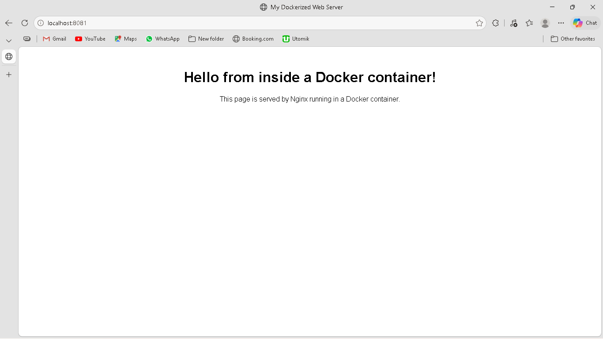
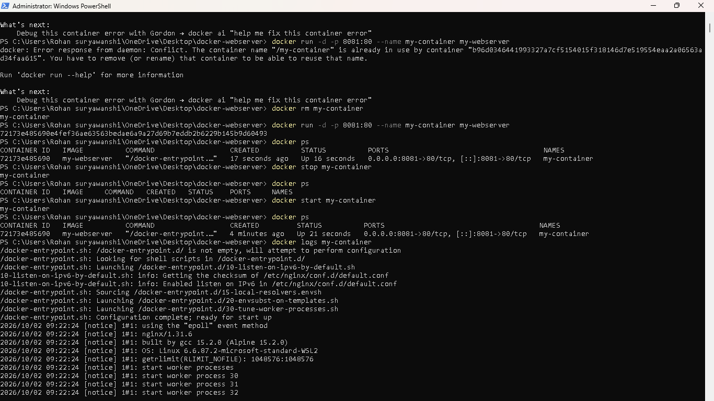
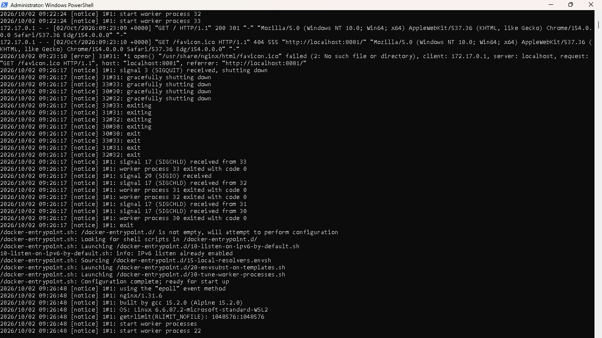
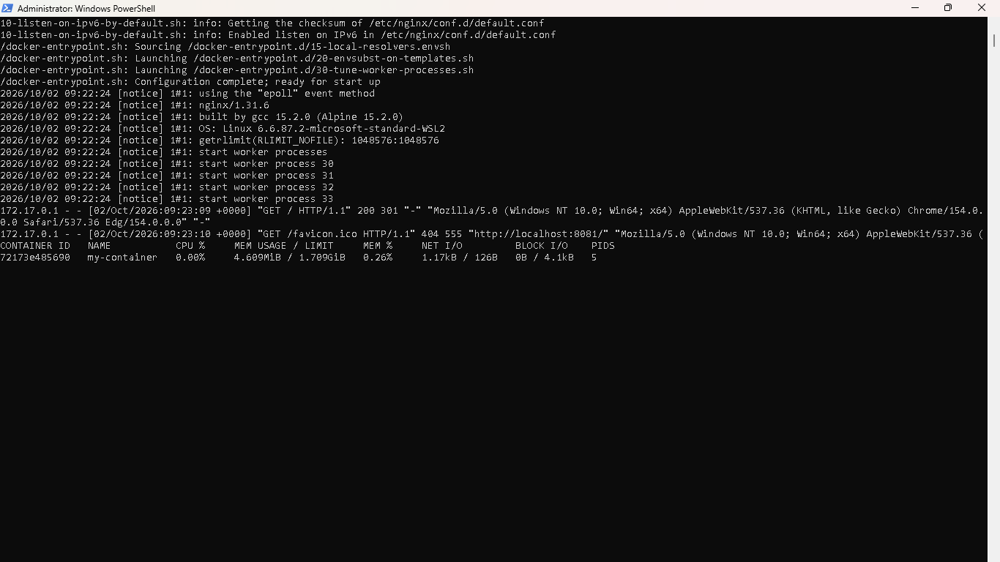
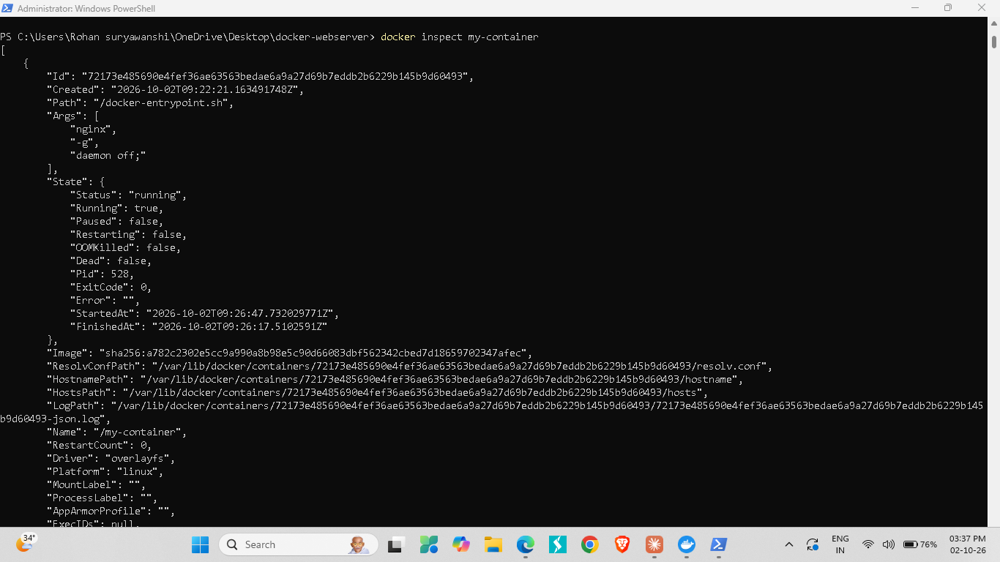
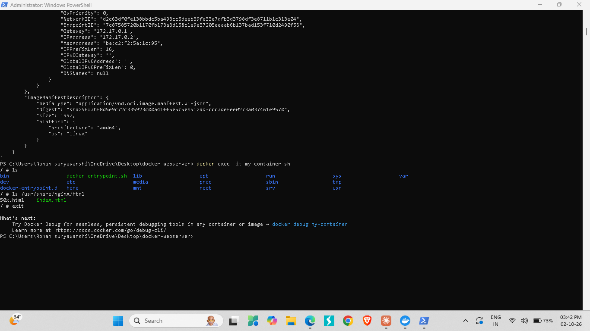

# Web Server using Docker

A hands-on internship project demonstrating **Docker containerization** — building a custom Nginx-based web server image, deploying it as a container, and working through the full container lifecycle, monitoring, and troubleshooting workflow.

## Objectives

- Learn Docker containerization basics
- Deploy and manage a web server inside Docker containers
- Understand container lifecycle and commands
- Monitor container health and troubleshoot issues
- Explore container-based app deployment best practices

## Tech Stack

- Docker Desktop (Windows, with WSL 2 backend)
- Nginx (`nginx:alpine` base image)
- Custom static HTML page

## Project Structure

```
docker-webserver/
├── Dockerfile
└── index.html
```

**Dockerfile:**
```dockerfile
FROM nginx:alpine
COPY index.html /usr/share/nginx/html/index.html
EXPOSE 80
```

A minimal, purpose-built image rather than just running the stock Nginx image — this demonstrates actually understanding image layers (base image → copy custom content → expose port) rather than only consuming a pre-built container.

## Setup & Deployment

### 1. Environment Setup
- Installed **WSL 2** (Docker Desktop's required backend on Windows)
- Installed **Docker Desktop**, verified with the standard `hello-world` test image

### 2. Build the Image
```bash
docker build -t my-webserver .
```
Builds a custom image named `my-webserver` from the Dockerfile in the current directory — layering a custom `index.html` on top of the lightweight `nginx:alpine` base.

### 3. Run the Container
```bash
docker run -d -p 8081:80 --name my-container my-webserver
```
- `-d` — runs in detached (background) mode
- `-p 8081:80` — maps port 8081 on the host to port 80 inside the container
- `--name my-container` — a readable name instead of a random ID

### 4. Verify
```bash
docker ps
```
Confirms the container is up, and the page is live at **http://localhost:8081**.

## Container Lifecycle

Demonstrated the full lifecycle without destroying the container:

```bash
docker stop my-container     # stop it
docker ps                    # confirms it's no longer running
docker start my-container    # bring it back
docker ps                    # confirms it's running again
```

This is distinct from `docker rm`, which permanently deletes a container — `stop`/`start` preserves it.

## Monitoring Container Health

```bash
docker stats my-container
```
Live view of CPU%, memory usage/limit, network I/O, and block I/O — the container ran at **~4.6 MB memory** and effectively 0% CPU at idle, showing how lightweight containerized Nginx is compared to a full VM.

## Troubleshooting Techniques

**Viewing logs:**
```bash
docker logs my-container
```
Showed real Nginx access logs, including a `200` for the page load and a natural `404` for `/favicon.ico` (expected — browsers auto-request a favicon that wasn't provided).

**Inspecting container internals:**
```bash
docker inspect my-container
```
Full JSON detail — IP address, port mappings, mount paths, restart count, image digest, and more. Useful for deep debugging when something isn't behaving as expected.

**Getting a shell inside the running container:**
```bash
docker exec -it my-container sh
ls /usr/share/nginx/html
exit
```
Confirmed `index.html` was correctly copied into the container's filesystem at the expected Nginx path — the core technique for debugging a misbehaving container from the inside.

## Challenges & Troubleshooting

| Issue | Cause | Fix |
|---|---|---|
| `docker` commands failed with "failed to connect to the docker API" | Docker Desktop app wasn't running in the background | Opened Docker Desktop, waited for it to fully start before retrying |
| Build/run commands run from the wrong folder | OneDrive silently redirects the Windows "Desktop" folder to a different path than expected | Used `cd $env:OneDrive\Desktop\...` to reach the real folder location |
| `docker run` failed: "ports are not available... port 8080" | Port 8080 was already in use by another process on the host | Switched to port 8081 instead |
| "Conflict: container name already in use" | A previous failed `run` attempt still left a container registered under that name | `docker rm my-container` to clear it before retrying |

## Result

A custom web server image running cleanly in an isolated container, reachable at `http://localhost:8081`, with full command-line control over its lifecycle, live health monitoring, and multiple troubleshooting paths (logs, inspect, interactive shell) demonstrated end-to-end.

## Screenshots

**Custom page served from the container:**


**Container lifecycle — stop and start:**


**Container logs (Nginx access log):**


**Live health monitoring with `docker stats`:**


**Deep inspection with `docker inspect`:**


**Troubleshooting via interactive shell:**


## Key Takeaways

- A custom Dockerfile is a reproducible, version-controllable way to package an application — far more reliable than manually configuring a server each time.
- Containers are dramatically lighter than VMs: this Nginx container idled at under 5 MB of memory.
- Docker's lifecycle commands (`stop`/`start`/`rm`) give fine-grained control distinct from simply "on" or "off."
- Real troubleshooting (port conflicts, daemon not running, path redirection issues) is a normal part of containerized development, and Docker provides multiple built-in tools (`logs`, `inspect`, `exec`) to diagnose problems without guesswork.
